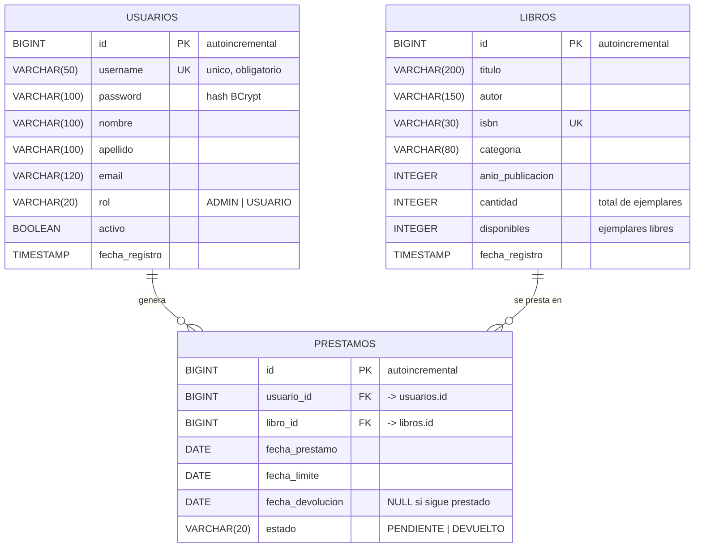
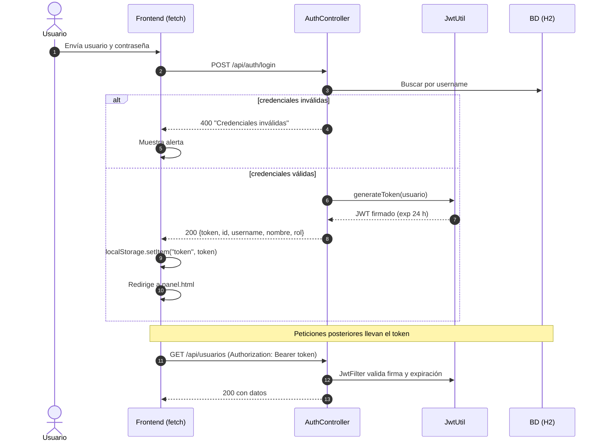

# INFORME — Sistema de Gestión de Biblioteca
## Login con Spring Boot + JWT consumido desde JavaScript con Fetch

**Proyecto:** `gestion_biblioteca`
**Backend:** Spring Boot 3 + Spring Security + JWT (jjwt) + Spring Data JPA + H2
**Frontend:** HTML5 + CSS3 (responsive) + JavaScript (Fetch API)
**Ubicación:** `C:\Users\srnar\Desktop\entornos\gestion_biblioteca`

---

## 1. Objetivo

Construir una aplicación web completa de gestión de biblioteca que cumpla con el
enunciado de la asignatura:

> "Construir un login completo usando Spring Boot para el Backend, asignando la
> seguridad a través de JWT y consumirlo con JavaScript Genérico usando FETCH u
> otra tecnología a la aplicada por el profesor (XMLHttpRequest)."

El sistema permite administrar **usuarios, libros y préstamos**, y todas las
operaciones distintas al login exigen un **token JWT válido**.

---

## 2. Tecnologías utilizadas

| Capa | Tecnología | Uso en el proyecto |
|------|-----------|--------------------|
| Backend | Spring Boot 3.2 | Framework principal, servidor embebido Tomcat en el puerto 8080 |
| Seguridad | Spring Security 6 | Cadena de filtros, CORS, encriptación de contraseñas |
| Token | JJWT 0.12 (io.jsonwebtoken) | Generación, firma y validación de tokens JWT (HMAC-SHA256) |
| Persistencia | Spring Data JPA / Hibernate | Mapeo objeto-relacional (entidades → tablas) |
| Base de datos | H2 en modo archivo | BD embebida `backend/data/biblioteca.mv.db`, con consola web habilitada |
| Frontend | HTML5 + CSS3 | Interfaz responsive (login y panel de administración) |
| Frontend | JavaScript (Fetch API) | Consumo de la API REST, autenticación y CRUD |
| Diseño | CSS Grid/Flexbox + Media Queries | Layout adaptable (breakpoints en 992 / 900 / 640 / 500 / 460 px) |

> La tecnología de consumo elegida es **`fetch`** (API moderna de JavaScript).
> La alternativa clásica `XMLHttpRequest` no se usó porque `fetch` es estándar
> en navegadores actuales y devuelve promesas, lo que simplifica el manejo de
> errores y el control de estados de carga.

---

## 3. Arquitectura del proyecto

```
gestion_biblioteca/
├── backend/                       API REST (Spring Boot)
│   ├── src/main/java/com/biblioteca/
│   │   ├── config/                SecurityConfig, DataInitializer
│   │   ├── controller/            AuthController, UsuarioController,
│   │   │                           LibroController, PrestamoController
│   │   ├── dto/                   LoginRequest, LoginResponse, UsuarioDto...
│   │   ├── entity/                Usuario, Libro, Prestamo (JPA)
│   │   ├── exception/             GlobalExceptionHandler
│   │   ├── repository/            Spring Data JPA (interfaces)
│   │   ├── security/              JwtUtil, JwtFilter  ← núcleo del JWT
│   │   └── service/               Lógica de negocio
│   ├── src/main/resources/application.properties
│   └── data/biblioteca.mv.db      Base de datos H2
├── frontend/                      Interfaz (HTML + CSS + JS)
│   ├── index.html                 Login
│   ├── panel.html                 Panel de administración
│   ├── css/estilos.css            Design system + responsive
│   └── js/
│       ├── api.js                 Cliente HTTP (fetch), token, toasts
│       ├── auth.js                Lógica del login
│       ├── panel.js               Navegación, modales, foco
│       ├── usuarios.js            CRUD de usuarios
│       ├── libros.js              CRUD de libros
│       └── prestamos.js           CRUD y devoluciones
├── bd/
│   ├── schema.sql                 Código SQL que crea el diagrama de la BD
│   ├── diagrama-bd.mmd            Diagrama entidad-relación (Mermaid)
│   └── diagrama-flujo-jwt.mmd     Diagrama de secuencia del login JWT
├── iniciar-proyecto.ps1           Script de arranque (backend + frontend)
└── INFORME.md                     Este documento
```

Flujo de una request protegida:

```
Navegador (fetch + Authorization: Bearer) 
   → JwtFilter (verifica firma y expiración) 
   → SecurityContext (Authentication con ROLE_ADMIN/USUARIO) 
   → Controller 
   → Service 
   → Repository 
   → H2
```

---

## 4. Base de datos

### 4.1 Diagrama entidad-relación



El diagrama también está disponible como archivo de código en
[`bd/schema.sql`](bd/schema.sql) (DDL completo) y
[`bd/diagrama-bd.mmd`](bd/diagrama-bd.mmd) (Mermaid).

### 4.2 Descripción de las tablas

| Tabla | Descripción | Campos principales |
|-------|-------------|--------------------|
| `usuarios` | Cuentas del sistema. `password` almacena el **hash BCrypt**, nunca el texto plano. | `id` (PK), `username` (único), `password`, `nombre`, `apellido`, `email`, `rol`, `activo`, `fecha_registro` |
| `libros` | Catálogo de la biblioteca. `cantidad` es el total de ejemplares y `disponibles` los libres. | `id` (PK), `titulo`, `autor`, `isbn` (único), `categoria`, `anio_publicacion`, `cantidad`, `disponibles`, `fecha_registro` |
| `prestamos` | Tabla puente que relaciona usuarios y libros (relación N:M). | `id` (PK), `usuario_id` (FK→usuarios), `libro_id` (FK→libros), `fecha_prestamo`, `fecha_limite`, `fecha_devolucion`, `estado` |

**Relaciones:** un usuario puede tener muchos préstamos (1:N) y un libro puede
estar en muchos préstamos (1:N). La relación entre `usuarios` y `libros` es
muchos-a-muchos y se modela mediante la tabla intermedia `prestamos`.

**Restricciones de integridad:** claves primarias identity, unicidad de
`username` e `isbn`, claves foráneas con integridad referencial, y
`CHECK (disponibles <= cantidad)` para impedir inventarios imposibles.

**Código para crear la base de datos:** el archivo [`bd/schema.sql`](bd/schema.sql)
contiene los `CREATE TABLE`, índices y las constantes de `CHECK`, compatible con
H2, MySQL y PostgreSQL.

---

## 5. Seguridad: autenticación con JWT

### 5.1 Flujo completo del login



### 5.2 Componentes implementados

| Componente | Archivo | Responsabilidad |
|------------|---------|-----------------|
| Generación del token | `security/JwtUtil.java` | Construye el JWT con `jjwt`: `subject`=username, claims `rol` y `nombre`, `issuedAt`, `expiration` (24 h) y firma HMAC con la clave secreta. |
| Validación del token | `security/JwtFilter.java` | Filtro `OncePerRequestFilter`: lee la cabecera `Authorization: Bearer <token>`, verifica firma/expiración, busca el usuario y crea el `Authentication` con su rol. |
| Configuración de seguridad | `config/SecurityConfig.java` | Sesiones `STATELESS` (sin sesiones HTTP), CSRF deshabilitado, CORS abierto para el frontend, `BCryptPasswordEncoder`, solo `/api/auth/login` y `/h2-console` son públicos, respuestas 401/403 en JSON. |

### 5.3 Código clave

**Generación del token** (`JwtUtil.java`):

```java
public String generateToken(Usuario usuario) {
    return Jwts.builder()
            .subject(usuario.getUsername())
            .claim("rol", usuario.getRol())
            .claim("nombre", usuario.getNombre() + " " + usuario.getApellido())
            .issuedAt(new Date())
            .expiration(new Date(System.currentTimeMillis() + expiration))
            .signWith(getKey())          // HMAC-SHA256 con la clave secreta
            .compact();
}
```

**Validación en cada request** (`JwtFilter.java`):

```java
String header = request.getHeader("Authorization");
if (header != null && header.startsWith("Bearer ")) {
    String token = header.substring(7);
    String username = jwtUtil.extractUsername(token);   // verifica la firma
    Usuario usuario = usuarioRepository.findByUsername(username).orElse(null);
    if (usuario != null && jwtUtil.isValid(token, usuario)) {
        // Rol para Spring Security: ADMIN -> ROLE_ADMIN
        SecurityContextHolder.getContext().setAuthentication(
            new UsernamePasswordAuthenticationToken(usuario, null,
                List.of(new SimpleGrantedAuthority("ROLE_" + usuario.getRol()))));
    }
}
```

**Cliente HTTP con token** (`frontend/js/api.js`):

```javascript
async function apiRequest(path, method = 'GET', body = null) {
    const headers = { 'Content-Type': 'application/json' };
    const token = localStorage.getItem('token');
    if (token) headers['Authorization'] = 'Bearer ' + token;

    const res = await fetch(API_URL + path, {
        method, headers,
        body: body !== null ? JSON.stringify(body) : undefined
    });

    if (res.status === 401) {            // token vencido o inválido
        cerrarSesion();                   // borra token y usuario
        window.location.href = 'index.html';
        throw new Error('No autorizado');
    }
    if (!res.ok) throw new Error(/* mensaje del backend */);
    return await res.json();
}
```

### 5.4 Medidas de seguridad aplicadas

1. **Contraseñas encriptadas con BCrypt** (`PasswordEncoder`), nunca en texto plano.
2. **Token con expiración de 24 horas** (`jwt.expiration=86400000`).
3. **Firma digital HMAC-SHA256**: sin la clave secreta el token no puede ser falsificado.
4. **Sesiones sin estado (STATELESS)**: no se usan cookies de sesión; el token viaja en la cabecera.
5. **Mensaje genérico "Credenciales inválidas"**: no se revela si el usuario existe o no.
6. **Validación de usuario inactivo**: una cuenta desactivada no puede iniciar sesión.
7. **Reinicio automático de sesión** en el frontend ante cualquier respuesta 401.

---

## 6. Consumo desde JavaScript con Fetch

El frontend es **JavaScript genérico** (sin frameworks) y usa `fetch` para
consumir la API REST. El flujo del login en `frontend/js/auth.js` es:

```javascript
form.addEventListener('submit', async (e) => {
    e.preventDefault();
    const username = document.getElementById('username').value.trim();
    const password = document.getElementById('password').value;

    btn.disabled = true;                       // estado de carga
    btn.setAttribute('aria-busy', 'true');
    btn.innerHTML = spinnerBoton() + '<span>Ingresando...</span>';

    try {
        const resp = await apiRequest('/auth/login', 'POST', { username, password });
        localStorage.setItem('token', resp.data.token);
        localStorage.setItem('usuario', JSON.stringify(resp.data));
        window.location.href = 'panel.html';  // acceso al panel
    } catch (err) {
        setError(err.message);                 // mensaje en pantalla
    } finally {
        btn.disabled = false;
        btn.removeAttribute('aria-busy');
        btn.innerHTML = '<span>Entrar</span>';
    }
});
```

Características de la interfaz:

- **Login** (`index.html`): validaciones nativas (`required`), estado de carga con
  spinner, alerta de error accesible (`role="alert"`) y diseño responsive.
- **Panel** (`panel.html`): usuarios, libros y préstamos en tablas; en pantallas
  de ≤640 px las tablas se transforman en **tarjetas**; los formularios se abren
  en **modales accesibles** (`role="dialog"`, foco atrapado, cierre con `Escape`);
  avisos de éxito/error mediante **toasts** con `aria-live`.
- Todas las peticiones distintas al login viajan con el token JWT.

---

## 7. Endpoints de la API

| Método | Ruta | Descripción | Acceso |
|--------|------|-------------|--------|
| POST | `/api/auth/login` | Autentica al usuario y devuelve el token JWT | Público |
| GET | `/api/auth/me` | Datos del usuario autenticado | JWT |
| GET | `/api/usuarios` | Lista usuarios | JWT |
| POST | `/api/usuarios` | Crea usuario | JWT |
| PUT | `/api/usuarios/{id}` | Actualiza usuario | JWT |
| DELETE | `/api/usuarios/{id}` | Elimina usuario | JWT |
| GET | `/api/libros` | Lista libros | JWT |
| POST | `/api/libros` | Crea libro | JWT |
| PUT | `/api/libros/{id}` | Actualiza libro | JWT |
| DELETE | `/api/libros/{id}` | Elimina libro | JWT |
| GET | `/api/prestamos` | Lista préstamos | JWT |
| POST | `/api/prestamos` | Registra préstamo (descuenta un ejemplar) | JWT |
| PUT | `/api/prestamos/{id}` | Actualiza/devuelve préstamo | JWT |
| DELETE | `/api/prestamos/{id}` | Elimina préstamo | JWT |

Formato uniforme de respuesta (`api/ApiResponse.java`):

```json
{ "success": true, "message": "Operación exitosa", "data": { } }
```

---

## 8. Cómo se desarrolló la solución (proceso)

1. **Definición del modelo de datos.** Se identificaron las tres entidades del
   dominio (Usuario, Libro, Préstamo) y sus relaciones. El préstamo se modeló
   como tabla puente N:M entre usuarios y libros, con control de exemplares
   mediante `cantidad` y `disponibles`.
2. **Diseño del esquema.** Se escribió el DDL en `bd/schema.sql` con claves
   primarias identity, claves foráneas, índices y restricciones `CHECK`.
   El diagrama entidad-relación se documentó en Mermaid para su renderizado.
3. **Implementación del backend.** Se crearon las entidades JPA, los
   repositorios de Spring Data, los servicios con la lógica de negocio
   (incluida la validación de ejemplares disponibles al prestar y al devolver),
   y los controladores REST.
4. **Implementación de la seguridad.** Se configuró Spring Security con
   sesiones sin estado, se implementó `JwtUtil` (generación y validación de
   tokens con jjwt) y `JwtFilter` (extracción del token de la cabecera
   `Authorization` y construcción del contexto de seguridad). Solo el login
   quedó como ruta pública.
5. **Datos iniciales.** `DataInitializer` crea, si la tabla está vacía, tres
   usuarios de prueba (`admin/admin123`, `jperez/123456`, `mgomez/123456`) y
   cuatro libros de ejemplo.
6. **Construcción del frontend.** Se desarrolló el login y el panel de
   administración con JavaScript puro. Se centralizó toda la comunicación HTTP en
   `apiRequest()` (fetch), que adjunta el token y gestiona el 401.
7. **Diseño visual y responsive.** Se creó un design system en CSS (variables,
   componentes, insignias de estado, toasts, modales) con puntos de quiebre para
   escritorio, tablet y móvil.
8. **Verificación.** Se probó el flujo completo en el navegador: login correcto
   e incorrecto, navegación entre secciones, alta/edición/borrado, préstamos,
   y comportamiento responsive en 1280, 768, 390 y 320 px de ancho.

---

## 9. Pruebas realizadas

| Prueba | Resultado |
|--------|-----------|
| Login con credenciales válidas (`admin/admin123`) | ✅ Devuelve token y redirige al panel |
| Login con credenciales inválidas | ✅ Muestra "Credenciales inválidas" (HTTP 400) |
| Acceso a `/api/usuarios` sin token | ✅ HTTP 401 (token expirado → regreso al login) |
| Acceso a `/api/usuarios` con token | ✅ HTTP 200 con datos |
| CRUD de usuarios, libros y préstamos | ✅ Correcto, con toasts de confirmación |
| Devolución de préstamo | ✅ Actualiza el estado y devuelve el ejemplar |
| Layout responsive 1280 / 768 / 390 / 320 px | ✅ Sin desbordes horizontales |

---

## 10. Instrucciones de ejecución

### Opción A — Script automático

```powershell
powershell -ExecutionPolicy Bypass -File .\iniciar-proyecto.ps1
```

### Opción B — Manual

**1. Backend** (debe estar libre el puerto 8080):

```powershell
cd backend
mvn spring-boot:run
```

**2. Frontend** (en otra terminal):

```powershell
npx http-server frontend -p 5500 -c-1
```

**3. Acceder a:** <http://localhost:5500/index.html>

> **Nota sobre el puerto 8080:** si aparece *"Port 8080 was already in use"*,
> otro programa (por ejemplo Apache/httpd) lo está usando. Deténgalo desde una
> consola de PowerShell **como Administrador**:
> `Stop-Service PEMHTTPD-x64`.

### Credenciales

| Usuario | Contraseña | Rol |
|---------|-----------|-----|
| `admin` | `admin123` | ADMIN |
| `jperez` | `123456` | USUARIO |
| `mgomez` | `123456` | USUARIO |

### Consola de base de datos

<http://localhost:8080/h2-console>

- JDBC URL: `jdbc:h2:file:./data/biblioteca`
- Usuario: `sa` — Contraseña: *(vacía)*

---

## 11. Conclusiones

La solución implementa un **login completo con Spring Boot y JWT**, consumido desde
JavaScript genérico mediante `fetch`, cumpliendo los requisitos del enunciado.
El token se genera en el backend tras validar las credenciales con BCrypt, viaja en
la cabecera `Authorization` de cada petición y es verificado por un filtro de
Spring Security antes de ejecutar cualquier lógica de negocio; las sesiones son
completamente sin estado. La base de datos se documentó con un diagrama
entidad-relación y su código DDL, y la aplicación se probó de extremo a extremo en
el navegador, incluyendo el comportamiento responsive.
